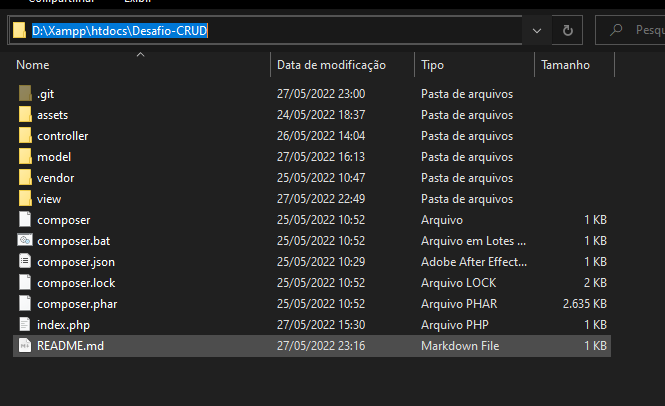
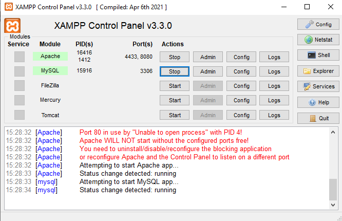

## Desafio CRUD da WEBDEC

Descrição: Desafio de criar um CRUD.

-----

##### :pushpin:Guia de Instalação

- Instale o XAMPP

  - Para rodar o projeto é necessário um servidor para processar o PHP, eu recomendo usar o XAMPP, instale ele com server Apache e o serviço MySql.
  - Depois de instalado vá até a pasta htdocs e coloque a pasta Desafio-CRUD para ser nossa pasta raiz, ficaria da seguinte forma **"D:\Xampp\htdocs\Desafio-CRUD"**

  - Dentro dos arquivos, existe alguns arquivos de instalação do Composer, caso necessite usar algum comando bastar abrir o terminal dentro dessa pasta e ele vai reconhecer o comando do Composer.
  - Depois de instalado devemos configurar o banco de dados, com XAMPP podemos acessar o phpMyAdmin para configurar o banco (antes ligue o serviço do MySql no painel)

  - Acesse localhost/phpmyadmin e configure o banco, crie um novo usuário com os seguintes dados:

    - Nome de utilizador: webdec
    - Nome do host -> escolha "local" e escreva ao lado "localhost"
    - Senha: webdec147
    - Abaixo marque a caixinha: "Criar banco de dados com o mesmo nome e conceder todos os privilégios."
    - Abaixo marque a caixinha: "Privilégios Globais" 

  - O mais **importante é que seu banco tenha o nome webdec**, caso queira criar outro acesso, você pode acessa o objeto de conexão com o banco e configurar seu acesso.

  - Depois de criado a conexão, acesse a tela de Login com o link localhost/Desafio-CRUD, se a tela de Login carregar sem nenhum erro é que está tudo certo para usar.

  - **Importante:** O próprio sistema vai identificar se existe as tabelas no banco, se não existe ele irá criar elas. Porém se quiser, eu deixei o arquivo de criação de tabelas disponível.

  - **Importante:** Também já foi criado um login já definido.

    - CPF: 460.867.220-72

    - Senha: 123456

      

---

:pushpin:Tecnologias Usadas

editar ainda
